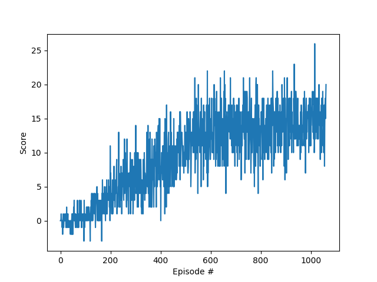

# Learning Algorithm

## Description of the algorithm

The implemented algorithm is an extension of the Q-Learning algorithm and extends it via deep neural networks to approximate the Q-Value function. This gives the agent the ability to learn high-dimensional and continuous state spaces. The original paper which introduced Deep Q-Learning is called *Playing Atari with Deep Reinforcement Learning* [Link](https://arxiv.org/abs/1312.5602).

Some highlights:

- *Deep neural networks* to approximate the Q-Value function
- *Experience Replay* is used to collect experiences during training and replay them for adapting the underlying weights of the neural net. This helps to break the correlation between consecutive samples.
- "Soft Update" to train the agent while maintaining a local and a target network. The local network is constantly updated via the experiences from the replay buffer. The target network is a copy of that local framework but is less frequently updated. This way, the Q-Value updates are less correlated with the current Q-value estimate, which stabilized the training and makes it more likeley to correlate.

The implementation is given in the file *dqn_agent.py* alongside detailed comments on the code. The agent and it's environment is controlled via the provided *navigation.ipynb* jupyter notebook.

## Chosen hyperparameters

## Architecture of the neural network

## Results

The environment was solved by the implmenemted algorithm after 962 episodes reaching an average Score of 15.00.

### Plot of Rewards

The below plot shows the performance of the algorithm:

Remark: Consider the environment as solved if the agent reaches at least a score of 13.

### Example video during training

The video shows how the agent selects actions during training:

[LearningAgent](./Agent_evaluation_recording_2025-02-12 23-01-56.mkv)

### Example video of trained agent in the banana environment

Watch the video below to see the fully trained agent:

[TrainedAgend](./Agent_training_recording_2025-02-12 22-24-00.mkv)

## Ideas for Future Work

As pointed out in the *Rainbow: Combining Improvements in Deep Reinforcement Learning* [Paper](https://arxiv.org/abs/1710.02298), there are several improvements already available. These are e.g.:

- Double DQN (DDQN)
- Prioritized experience replay
- Dueling DQN
- Learning from multi-step bootstrap targets(opens in a new tab)
- Distributional DQN(opens in a new tab)
- Noisy DQN

A good start would probably be adding *Prioritized experience replay* because it only demands minimal changes of the current implementation and as stated in the Rainbow paper will provide much better performance than the vanilla DQN algorithm.
